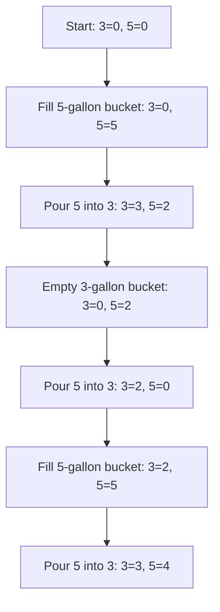
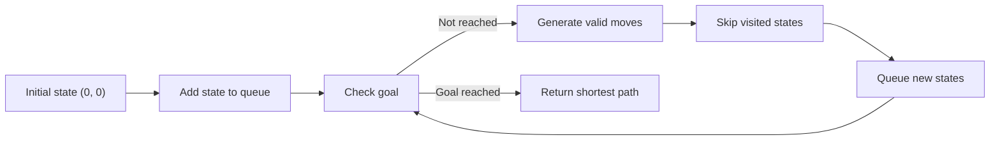

# Water Jug Solver

This project solves the classic water bucket problem:

> Two kids need to fetch exactly 4 gallons of water from a stream using only an unmarked 3-gallon bucket and an unmarked 5-gallon bucket, in fewer than 15 steps.

The program uses breadth-first search to find the shortest valid sequence of bucket actions. With the default settings, it finds a 6-step solution that leaves exactly 4 gallons in the 5-gallon bucket.

## Project Objective

- Measure 4 gallons of water.
- Use only a 3-gallon bucket and a 5-gallon bucket.
- Keep the solution under 15 steps.
- Print each step in a human-readable format.

## Requirements

- Python 3.10 or later
- No third-party packages

## How to Run

From the project root:

```bash
python outputs/water_jug_solver.py
```

To solve for exactly 4 gallons total across both buckets:

```bash
python outputs/water_jug_solver.py --goal total
```

To change the step limit:

```bash
python outputs/water_jug_solver.py --max-steps 14
```

## Default Solution

The default goal is to get exactly 4 gallons in one bucket.

```text
Start: 3-gallon bucket = 0, 5-gallon bucket = 0
1. Fill the 5-gallon bucket from the stream -> 3-gallon = 0, 5-gallon = 5
2. Pour the 5-gallon bucket into the 3-gallon bucket -> 3-gallon = 3, 5-gallon = 2
3. Empty the 3-gallon bucket -> 3-gallon = 0, 5-gallon = 2
4. Pour the 5-gallon bucket into the 3-gallon bucket -> 3-gallon = 2, 5-gallon = 0
5. Fill the 5-gallon bucket from the stream -> 3-gallon = 2, 5-gallon = 5
6. Pour the 5-gallon bucket into the 3-gallon bucket -> 3-gallon = 3, 5-gallon = 4
```

## Algorithm

The solver treats each bucket configuration as a state:

```text
(amount_in_3_gallon_bucket, amount_in_5_gallon_bucket)
```

From each state, it explores every valid action:

- Fill either bucket.
- Empty either bucket.
- Pour from the 3-gallon bucket into the 5-gallon bucket.
- Pour from the 5-gallon bucket into the 3-gallon bucket.

Breadth-first search is used because the first goal state it finds is the shortest solution.

## Mermaid Documentation



This Mermaid diagram summarizes the breadth-first search process.



## dbdiagram ERD Documentation

```dbml
Table states {
  id integer [primary key]
  three_gallon_amount integer [not null]
  five_gallon_amount integer [not null]
}

Table moves {
  id integer [primary key]
  description varchar [not null]
  from_state_id integer [not null]
  to_state_id integer [not null]
  step_number integer
}

Ref: moves.from_state_id > states.id
Ref: moves.to_state_id > states.id
```

DBML copy is also available in `docs/solver_state_model.dbml`.

## Validation

The project was checked with:

```bash
python -m py_compile outputs/water_jug_solver.py
python outputs/water_jug_solver.py
python outputs/water_jug_solver.py --goal total
```

The default solution completes in 6 steps, which satisfies the requirement of fewer than 15 steps.
